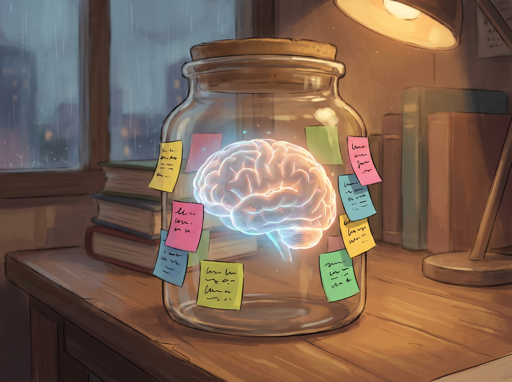

จำตอนที่แล้วได้ไหมครับที่เราคุยกันว่า coding agent เหมือนการมี Jarvis มาเป็นผู้ช่วยส่วนตัว วันนี้ผมจะพามาแงะดูข้างในกันครับ

บอกก่อนว่าเราจะยังไม่แตะโค้ดหรือติดตั้งอะไรทั้งนั้น เป้าหมายของตอนนี้คืออยากให้ทุกคนเห็นภาพว่าเบื้องหลังหน้าจอมันเกิดอะไรขึ้นเวลาเราพิมพ์สั่งงาน พอเห็นภาพรวมแล้ว คุณจะรู้สึกเลยว่าพวก agent เป็นแค่เครื่องมือที่เราควบคุมได้ ไม่ใช่เวทมนตร์อะไรครับ

วันนี้ผมจะพาไปหาคำตอบ 3 ข้อนี้กันครับ:

1. LLM คืออะไรกันแน่?
2. ทำไมแค่ LLM เพียวๆ ถึงยังไม่พอ?
3. อะไรที่เปลี่ยน LLM ให้กลายเป็น *agent*?

มาลุยกันเลย!

## สมอง: Large Language Model คืออะไรกันแน่?

พูดถึง Large Language Model (หรือ LLM อย่างพวก GPT, Claude และ Gemini) แก่นแท้ของมันก็คือระบบ **autocomplete** ที่ฉลาดแบบสุดๆ ครับ พอเราพิมพ์อะไรเข้าไป มันก็จะคำนวณว่าคำถัดไปควรจะเป็นคำว่าอะไร แล้วก็เดาต่อไปเรื่อยๆ จนกว่าจะหยุด

ใช่ครับ แค่นั้นเลยจริงๆ มันไม่มีกระบวนการคิด ไม่มีความเข้าใจ หรือความรู้สึกนึกคิดอะไรทั้งนั้น มันคือการเดาคำตามหลักสถิติล้วนๆ ที่รันซ้ำๆ กันเป็นพันเป็นหมื่นครั้ง

ฟังดูธรรมดามากใช่ไหมครับ แต่ความพีคคือโมเดลพวกนี้มันอ่านข้อมูลมาแล้วแทบจะครึ่งอินเทอร์เน็ต! การเดาคำของมันเลยแม่นเป๊ะจนน่าตกใจ แม่นจนทำให้เราเผลอคิดไปว่ามันคิดวิเคราะห์เป็น หรือมีความรู้จริงๆ ซึ่งเอาเข้าจริงมันก็ใช้งานได้ดีเลยล่ะครับ แต่ถ้าเจาะลงไปลึกๆ มันก็คือการ autocomplete อยู่ดี

> เวลาโมเดลพวกนี้มองข้อความของเรา มันจะหั่นเป็นชิ้นเล็กๆ ที่เรียกว่า *token* ครับ ถ้าใครอยากรู้ลึกเรื่องนี้ ลองแวะไปอ่าน [Token คืออะไรกันแน่?](../what-is-token-exactly/) ดูนะครับ

พอมันทำงานด้วยกลไกแบบนี้ มันก็เลยมีข้อจำกัดอยู่เพียบ อย่างแรกเลยคือมันจะรู้เฉพาะข้อมูลที่เคยอ่านตอนช่วงที่โดนเทรนมา ดังนั้นอะไรก็ตามที่เกิดขึ้นหลังวันตัดยอดข้อมูล (เช่น ข่าวเมื่อวาน สภาพอากาศวันนี้ หรือไฟล์โน้ตในเครื่องเรา) มันจะไม่รู้เรื่องเลย หนักไปกว่านั้นคือ ตัวมันเอง "ลงมือทำ" อะไรไม่ได้ครับ มันอาจจะสอนวิธีส่งอีเมลให้เราได้เป็นฉากๆ แต่มันกดส่งให้เราจริงๆ ไม่ได้ สรุปคือหน้าที่ของมันมีแค่รับข้อความเข้ามา แล้วก็พ่นข้อความกลับไป แค่นั้นเลย

## สมองในโหลแก้ว

อาการ "ทำอะไรไม่ได้" นี่แหละที่เป็นปัญหาใหญ่ ลองจินตนาการดูว่าเรามีผู้ช่วยอัจฉริยะที่อ่านหนังสือมาหมดทั้งโลก แต่ดันโดนจับขังไว้ในห้องปิดตาย ไม่มีหน้าต่าง ไม่มีโทรศัพท์ ไม่มีเน็ต สิ่งที่เราทำได้คือสอดกระดาษคำถามใต้ประตูเข้าไป แล้วรอเขาสอดคำตอบกลับมา... สภาพนั้นแหละครับคือ chatbot ที่เราใช้กันอยู่

ถามว่ามันมีประโยชน์ไหม? มีครับ แต่ก็จำกัดมากๆ เพราะ "สมองในโหลแก้ว" แบบนี้ไม่สามารถ:

- เช็กสภาพอากาศของวันนี้
- อ่านไฟล์ในคอมพิวเตอร์ของเรา
- กดเครื่องคิดเลขคำนวณโจทย์ยากๆ ที่คิดในหัวไม่ไหว
- ส่งอีเมล ทำพรีเซนต์ หรือเขียนสคริปต์แต่งรูปให้เรา

ถ้าอยากให้มันทำเรื่องพวกนี้ได้ สมองเพียวๆ ไม่พอครับ มันต้องมี **มือ** ด้วย

## เติมมือให้สมอง: จาก LLM สู่ agent

พูดง่ายๆ ว่า **agent** ก็คือ LLM ที่ถูกจับมาติดอาวุธด้วยเครื่องมือ (tools) ต่างๆ นั่นเอง คำว่า tool ในที่นี้หมายถึงอะไรก็ตามที่ agent สามารถลงมือทำได้จริงๆ นอกเหนือจากการนั่งพิมพ์ตอบเราเฉยๆ อย่างเช่น ค้นหาข้อมูลบนเว็บ อ่านไฟล์ในเครื่อง รันสคริปต์ หรือแม้แต่ต่อ API ไปคุยกับแอปอื่น

> **Agent = LLM + Tools + ลูปที่เปิดให้มันหยิบ tool มาใช้ได้**

ความเจ๋งมันอยู่ตรง "ลูป" นี่แหละครับ ปกติเวลาเราคุยกับ chatbot ทั่วไป คำตอบจะเด้งพรวดออกมาทีเดียวจบ แต่เวลาเราสั่งงาน agent มันสามารถทำงานต่อเนื่องกันเป็นซีรีส์ได้เลย ลองนึกภาพตามนะครับ: คิดนิดนึง → หยิบ tool มาใช้ → รอดูผลลัพธ์ → เอามาคิดต่อ → หยิบ tool อีกอันมาใช้ → แล้วค่อยสรุปตอบเรา

สิบปากว่าไม่เท่าตาเห็น ลองมาดูความแตกต่างกันจะๆ ดีกว่าครับ



เห็นไหมครับ คำถามเดียวกันเป๊ะ แต่เบื้องหลังนี่คนละเรื่องเลย

## เจาะลึกการทำงานทีละสเต็ป

คราวนี้เราลองมาแกะรอยการทำงานของมันดูครับ สมมติว่าผมพิมพ์ถามไปว่า:

> *Le Sserafim เพิ่งปล่อยเพลงใหม่หรือเปล่า?*

อย่างที่รู้กันว่าความรู้ของ agent มันหยุดอัปเดตไปตั้งแต่หลายเดือนก่อน มันไม่มีทางรู้ข่าวใหม่ๆ แน่นอน ดังนั้นมันตอบจากความจำไม่ได้หรอก... แต่มันก็ไม่จำเป็นต้องจำแล้วล่ะครับ

ลองคลิกเล่นตามลูปด้านล่างดูนะครับ แต่ละสเต็ปคือหนึ่งแอคชั่นที่ agent กำลังทำอยู่



สังเกตจังหวะมันให้ดีๆ นะครับ มันจะ: คิดนิดนึง → ทำนิดนึง → รอดูผลลัพธ์ → แล้วกลับไปคิดใหม่ ตัว agent จะไม่ได้พ่นคำตอบออกมารวดเดียวจบ แต่มันจะสลับโหมดไปมาระหว่างการคิดวิเคราะห์กับการลงมือทำ (เรียกใช้ tool) ซึ่งทุกครั้งที่วนลูป มันก็จะได้เศษเสี้ยวข้อมูลเพิ่มขึ้นมาเรื่อยๆ

แพตเทิร์นการทำงานสไตล์นี้เป็นเรื่องปกติมากๆ ในวงการ agent จนถึงขั้นมีชื่อเรียกเฉพาะเท่ๆ ของมันเลยทีเดียว

## ลูปแห่งการคิดและลงมือทำ

กระบวนการที่เราเพิ่งดูกันไปเมื่อกี้ เขาเรียกกันว่าลูป **Think → Act → Observe** หรือชื่อเล่นในวงการคือ ReAct ("Reason + Act")[^react] ซึ่งบอกเลยว่า coding agent ยุคใหม่แทบทุกตัว (ไม่ว่าจะ Claude Code, Gemini CLI, OpenCode หรือ Codex) ก็ใช้ลูปหน้าตาประมาณนี้เป็นแกนหลักกันทั้งนั้นครับ

<svg viewBox="0 0 480 280" xmlns="http://www.w3.org/2000/svg">
  <defs>
    <marker id="loop-arrow" viewBox="0 0 10 10" refX="9" refY="5" markerWidth="6" markerHeight="6" orient="auto-start-reverse">
      <path d="M0,0 L10,5 L0,10 z" fill="currentColor"/>
    </marker>
  </defs>
  <g fill="none" stroke="currentColor" stroke-width="2" stroke-linecap="round" marker-end="url(#loop-arrow)">
    <path d="M 160 90 Q 240 50 320 90"/>
    <path d="M 350 130 Q 350 200 280 220"/>
    <path d="M 200 220 Q 130 200 130 130"/>
  </g>
  <g>
    <circle cx="120" cy="100" r="46" fill="var(--role-think-tint)" stroke="var(--role-think)" stroke-width="2"/>
    <text x="120" y="96" text-anchor="middle" font-size="15" font-weight="600" fill="currentColor">Think</text>
    <text x="120" y="116" text-anchor="middle" font-size="11" fill="currentColor" opacity="0.7">reason</text>
  </g>
  <g>
    <circle cx="360" cy="100" r="46" fill="var(--role-act-tint)" stroke="var(--role-act)" stroke-width="2"/>
    <text x="360" y="96" text-anchor="middle" font-size="15" font-weight="600" fill="currentColor">Act</text>
    <text x="360" y="116" text-anchor="middle" font-size="11" fill="currentColor" opacity="0.7">call a tool</text>
  </g>
  <g>
    <circle cx="240" cy="230" r="46" fill="var(--role-observe-tint)" stroke="var(--role-observe)" stroke-width="2"/>
    <text x="240" y="226" text-anchor="middle" font-size="15" font-weight="600" fill="currentColor">Observe</text>
    <text x="240" y="246" text-anchor="middle" font-size="11" fill="currentColor" opacity="0.7">read result</text>
  </g>
  <g>
    <path d="M 240 184 L 240 150" stroke="currentColor" stroke-width="2" stroke-dasharray="4 4" fill="none"/>
    <text x="252" y="170" font-size="11" fill="currentColor" opacity="0.6">…or answer</text>
  </g>
</svg>

เจาะลงไปอีกนิด ในเฟส think ตัว LLM จะเริ่มวางแผนว่าต้องทำอะไรต่อ นี่แหละคือจุดที่ทำให้มันดูเหมือนฉลาดและคิดเป็น พอเข้าเฟส act มันก็จะไปหยิบ tool ที่ใช่ขึ้นมาใช้ และสุดท้ายเฟส observe คือจังหวะที่มันกางผลลัพธ์จาก tool ออกมาดู

ที่เจ๋งคือ ต่อให้มันรันคำสั่งแล้วพัง (เช่น ลิงก์ตายหรือเว็บล่ม) agent มันก็จะอ่าน error นั้น แล้วกลับไปคิดหาวิธีแก้เกมมาลองใหม่ ลูปนี้จะวนไปเรื่อยๆ จนกว่ามันจะรวบรวมข้อมูลได้ครบถ้วนพอที่จะตอบเรา หรือไม่ก็จนกว่ามันจะไปต่อไม่เป็นแล้วหันมาฟ้องเราว่า "ผมช่วยไม่ได้แล้ว ไปต่อไม่เป็นจริงๆ"

เบื้องหลังความเก่งของมันก็มีแค่นี้เองครับ

## อะไรบ้างที่เรียกว่าเป็น tool?

แล้วคำว่า tool ในมุมของ agent นี่มันครอบคลุมแค่ไหน? จริงๆ ก็คืออะไรก็ตามที่มันสั่งงานไปแล้วได้ผลลัพธ์กลับมานั่นแหละครับ

  

    

      <svg viewBox="0 0 24 24" width="28" height="28" fill="none" stroke="currentColor" stroke-width="2" stroke-linecap="round" stroke-linejoin="round"><circle cx="11" cy="11" r="7"/><line x1="21" y1="21" x2="16.5" y2="16.5"/></svg>
    

    
ค้นเว็บ

    
พิมพ์คำค้นหา แล้วรับผลลัพธ์กลับมา เหมือนที่เราค้นเองเลย

  

  

    

      <svg viewBox="0 0 24 24" width="28" height="28" fill="none" stroke="currentColor" stroke-width="2" stroke-linecap="round" stroke-linejoin="round"><path d="M14 2H6a2 2 0 0 0-2 2v16a2 2 0 0 0 2 2h12a2 2 0 0 0 2-2V8z"/><polyline points="14 2 14 8 20 8"/><line x1="8" y1="13" x2="16" y2="13"/><line x1="8" y1="17" x2="14" y2="17"/></svg>
    

    
ไฟล์

    
เปิดไฟล์ในโปรเจกต์ แก้ไข หรือสร้างไฟล์ใหม่ได้เลย

  

  

    

      <svg viewBox="0 0 24 24" width="28" height="28" fill="none" stroke="currentColor" stroke-width="2" stroke-linecap="round" stroke-linejoin="round"><polyline points="4 17 10 11 4 5"/><line x1="12" y1="19" x2="20" y2="19"/></svg>
    

    
Terminal

    
สั่งรันคำสั่งต่างๆ เพื่อจัดการไฟล์ เช็คการเปลี่ยนแปลง หรือติดตั้งโปรแกรม

  

  

    

      <svg viewBox="0 0 24 24" width="28" height="28" fill="none" stroke="currentColor" stroke-width="2" stroke-linecap="round" stroke-linejoin="round"><polyline points="16 18 22 12 16 6"/><polyline points="8 6 2 12 8 18"/></svg>
    

    
รันโค้ด

    
เขียนสคริปต์ Python หรือ JavaScript แล้วให้มันรันออกมาเลย

  

สำหรับสาย coding agent แล้ว tool ฮิตๆ ก็คือการทำอะไรก็ตามที่เราทำบนคอมพิวเตอร์ตัวเองได้นั่นแหละ (เช่น เปิดโฟลเดอร์ ค้นข้อมูล หรือสั่งรันโปรแกรม) agent ก็ทำได้เหมือนกันเป๊ะ นี่คือเหตุผลหลักที่ทำให้ coding agent ทรงพลังกว่าพวก chatbot ทั่วไปหลายขุม เพราะมันมองคอมพิวเตอร์ของเราทั้งเครื่องเป็นสนามเด็กเล่นของมันเลย เดี๋ยวเราค่อยไปเจาะลึกเรื่อง tools เฉพาะทางอย่าง `terminal`, Python หรือ JavaScript กันแบบเต็มๆ ในตอนหน้านะครับ

## เรื่องของ context (และสิ่งที่ agent "จำ" ได้)

มาถึงจิ๊กซอว์ชิ้นสุดท้ายกันครับ หลายคนอาจจะสงสัยว่า แล้ว agent มันรู้ได้ไงว่าต้องทำอะไร? ในเมื่อมันมองไม่เห็นหน้าจอเรา แถมอ่านใจเราก็ไม่ได้ ความลับคือทุกสิ่งทุกอย่างที่มันรู้และลงมือทำ ล้วนมาจากก้อนข้อความยาวๆ ก้อนเดียวที่ระบบส่งไปให้มัน ซึ่งเราเรียกก้อนนี้ว่า **context** ครับ

<svg viewBox="0 0 520 260" xmlns="http://www.w3.org/2000/svg">
  <g font-family="inherit" fill="currentColor">
    <g>
      <rect x="40" y="30" width="380" height="48" rx="8" fill="var(--role-think-tint)" stroke="var(--role-think)" stroke-width="1.5"/>
      <text x="56" y="52" font-size="13" font-weight="600">System prompt</text>
      <text x="56" y="68" font-size="11" opacity="0.7">"You are a coding assistant. Tools available: search, read_file, run_shell…"</text>
    </g>
    <g>
      <rect x="40" y="92" width="380" height="48" rx="8" fill="var(--role-observe-tint)" stroke="var(--role-observe)" stroke-width="1.5"/>
      <text x="56" y="114" font-size="13" font-weight="600">Your message</text>
      <text x="56" y="130" font-size="11" opacity="0.7">"Le Sserafim เพิ่งปล่อยเพลงใหม่หรือเปล่า?"</text>
    </g>
    <g>
      <rect x="40" y="154" width="380" height="64" rx="8" fill="var(--role-act-tint)" stroke="var(--role-act)" stroke-width="1.5"/>
      <text x="56" y="176" font-size="13" font-weight="600">Conversation so far</text>
      <text x="56" y="192" font-size="11" opacity="0.7">ประวัติการแชท, tool calls,</text>
      <text x="56" y="206" font-size="11" opacity="0.7">และผลลัพธ์จาก tool ทุกรอบในเซสชันนี้</text>
    </g>
    <path d="M 430 30 Q 460 30 460 124 Q 460 218 430 218" fill="none" stroke="currentColor" stroke-width="1.5" opacity="0.6"/>
    <text x="472" y="118" font-size="13" font-weight="600">=</text>
    <text x="472" y="138" font-size="13" font-weight="600">Context</text>
  </g>
</svg>

ถ้าเราแงะดูข้างใน context เราจะเจอข้อมูลเรียงกันตามนี้เลยครับ:

1. **System prompt** — คำสั่งเบื้องหลังที่คนสร้าง agent เขียนฝังเอาไว้ (อารมณ์ประมาณว่า "คุณคือผู้ช่วยเขียนโค้ดที่เก่งมากนะ นี่คือ tools ที่คุณมี และนี่คือวิธีใช้มัน") ซึ่งปกติเราจะมองไม่เห็นและแก้ไม่ได้ครับ มันฝังมากับตัว agent เลย
2. **Your message** — ข้อความคำสั่งหรือสิ่งที่เราพิมพ์คุยกับมัน
3. **The conversation so far** — ประวัติการแชททั้งหมดที่คุยกันมา รวมถึงผลลัพธ์ที่ได้จากการใช้ tool ทุกรอบในรอบการคุยนั้น

กฎเหล็กคือ ในทุกๆ ครั้งที่มันวนลูป context ทั้งก้อนจะถูกส่งกลับไปให้ LLM อ่านใหม่ตั้งแต่ต้นจนจบ เพื่อให้มันประมวลผลและคิดสเต็ปต่อไปออกมาได้

ลองนึกย้อนไปตอนที่ agent ค้นหาข้อมูลน้องๆ Le Sserafim เมื่อกี้ ผลลัพธ์ที่ได้มันไม่ได้หายไปไหนนะครับ แต่มันถูกเอาไปแปะต่อท้ายตรงส่วนประวัติการแชท เพื่อที่เวลาลูปรอบถัดไปเริ่มขึ้น มันจะได้ดึงข้อมูลตรงนี้มาอ่านได้ นี่แหละคือวิธีที่ทำให้ agent ดูเหมือน "จำ" สิ่งที่มันเพิ่งหาเจอเมื่อไม่กี่วินาทีก่อนได้ ทั้งที่โครงสร้างจริงๆ ของมันไม่มีหน่วยความจำอะไรเลย

แต่ต้องโน้ตไว้นิดนึงว่า ความจำพวกนี้มันจะจบแค่ในเซสชันนั้นๆ นะครับ ถ้าเรากดปิด `terminal` ปุ๊บ agent ก็จะลบความจำและลืมเราทันที (ยกเว้นบางตัวที่อาจจะจำข้ามรอบได้ผ่านไฟล์อย่าง `CLAUDE.md` ซึ่งเดี๋ยวเราค่อยไปคุยกันในตอนที่ 3) อีกเรื่องคือ context มันมีพื้นที่จำกัด ถ้าคุยกันยาวมากๆ สักพักความจำมันก็จะเต็ม และอย่างที่ย้ำไป... สิ่งที่อยู่ใน context คือ "โลกทั้งใบ" ของมัน ถ้าเราไม่เคยป้อนข้อมูลอะไรเข้าไปให้มันเลย มันก็มืดแปดด้าน ไม่รู้เรื่องนั้นหรอกครับ

พอเราเข้าใจเบื้องหลังแบบนี้แล้ว วิธีที่เราคุยกับ agent ก็จะเปลี่ยนไปเลย ทักษะการเขียน prompt เก่งๆ เอาเข้าจริงมันก็คือการรู้ว่าจะป้อนข้อมูลสำคัญๆ ลงไปใน context ยังไงให้ชัดเจน เป็นระเบียบ และไม่ถูกข้อมูลขยะกลบหายไปนั่นเองครับ

## สรุปส่งท้าย

> **Agent** = Language Model + ชุด **Tools** + ลูป **Think → Act → Observe** และทุกสิ่งทุกอย่างที่มันรู้เกี่ยวกับงานตรงหน้าเรา ล้วนถูกเก็บอยู่ใน **Context** เท่านั้น

โครงสร้างหลักของมันมีแค่นี้จริงๆ ที่เหลือก็เป็นแค่รายละเอียดปลีกย่อยแล้วว่า จะหยิบโมเดลตัวไหนมาใช้ ยัด tool อะไรให้มันบ้าง ลูปจะซับซ้อนแค่ไหน หรือจะปั้น context ออกมาแบบไหน เราสามารถจับชิ้นส่วนพวกนี้มาปรับเปลี่ยนได้ตามใจชอบ แต่มองในภาพรวม มันก็คือ agent ตัวนึงอยู่ดี

เอาล่ะ ทฤษฎีแน่นแล้ว ใน **ตอนที่ 2** เราจะพักเรื่องหลักการ แล้วมาเริ่มลงสนามจริงกันสักทีครับ เราจะได้ลองเลือกตัว agent มาติดตั้ง ลองรันโปรแกรม และส่ง prompt ไปสั่งงานมันเป็นครั้งแรก รอติดตามกันได้เลยครับ

## แหล่งศึกษาเพิ่มเติม

เราปูพื้นฐานโครงสร้างหลักกันไปแล้ว ส่วนประกอบแต่ละชิ้นเดี๋ยวจะมีบทความเจาะลึกตามมาครับ:

- **Token คืออะไรกันแน่?** — LLM มองเห็นข้อความของเรายังไง *([อ่านได้แล้วที่นี่](../what-is-token-exactly/))*
- **AI คืออะไรกันแน่?** — เจาะลึกกระแส AI: neural network คืออะไร, การเทรนคืออะไร, โมเดลคืออะไร? *(เร็วๆ นี้)*
- **LLMs vs Agents แบบเจาะลึก** — เจาะลึกเรื่องลูป, prompts, และสิ่งที่ทำให้ agent แต่ละตัวต่างกัน *(เร็วๆ นี้)*
- **Shell และภาษาโปรแกรม** — Bash, PowerShell, Python, JavaScript: พาทัวร์แบบเป็นมิตรสำหรับคนที่ไม่ใช่โปรแกรมเมอร์ *(เร็วๆ นี้)*

## ลิงก์ที่มีประโยชน์

- **The ReAct paper**: Yao et al., *ReAct: Synergizing Reasoning and Acting in Language Models* (2022) — [arxiv.org/abs/2210.03629](https://arxiv.org/abs/2210.03629). เปเปอร์ต้นฉบับที่อธิบายเกี่ยวกับลูปนี้
- **Anthropic — Building effective agents**: [anthropic.com/research/building-effective-agents](https://www.anthropic.com/research/building-effective-agents). ภาพรวมแบบชัดเจนและอัปเดตล่าสุดว่า agent ในระดับ production ถูกออกแบบมายังไง
- **Coding agents** (น้ำจิ้มสำหรับตอนที่ 2): [Claude Code](https://claude.ai/code), [Gemini CLI](https://github.com/google-gemini/gemini-cli), [OpenCode](https://opencode.ai), [Codex CLI](https://github.com/openai/codex)

## อ้างอิง

[^react]: Shunyu Yao, Jeffrey Zhao, Dian Yu, Nan Du, Izhak Shafran, Karthik Narasimhan, Yuan Cao. *ReAct: Synergizing Reasoning and Acting in Language Models.* ICLR 2023. [arxiv.org/abs/2210.03629](https://arxiv.org/abs/2210.03629). งานวิจัยที่ตั้งชื่อลูป Think-Act-Observe และแสดงให้เห็นว่ามันทำงานได้ดีกว่าการใช้เหตุผลหรือการลงมือทำเพียงอย่างเดียว
